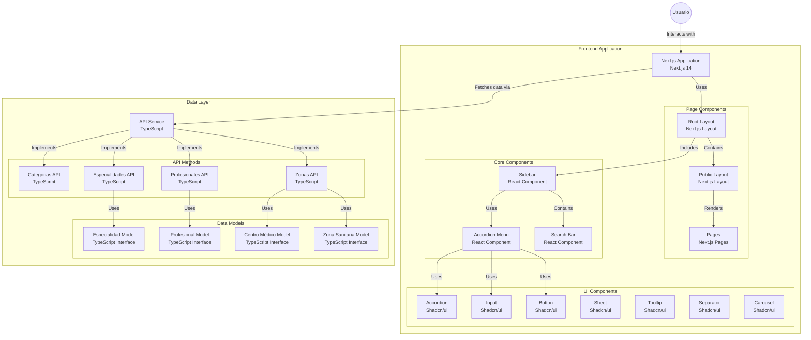

```mermaid
graph TB
    User((Usuario))

    subgraph "Frontend Application"
        NextApp["Next.js Application<br>Next.js 14"]
        
        subgraph "Page Components"
            RootLayout["Root Layout<br>Next.js Layout"]
            PublicLayout["Public Layout<br>Next.js Layout"]
            Pages["Pages<br>Next.js Pages"]
        end
        
        subgraph "Core Components"
            Sidebar["Sidebar<br>React Component"]
            SearchBar["Search Bar<br>React Component"]
            AccordionMenu["Accordion Menu<br>React Component"]
        end
        
        subgraph "UI Components"
            Button["Button<br>Shadcn/ui"]
            Input["Input<br>Shadcn/ui"]
            Accordion["Accordion<br>Shadcn/ui"]
            Sheet["Sheet<br>Shadcn/ui"]
            Tooltip["Tooltip<br>Shadcn/ui"]
            Separator["Separator<br>Shadcn/ui"]
            Carousel["Carousel<br>Shadcn/ui"]
        end
    end

    subgraph "Data Layer"
        APIService["API Service<br>TypeScript"]
        
        subgraph "Data Models"
            CentroMedicoModel["Centro Médico Model<br>TypeScript Interface"]
            ProfesionalModel["Profesional Model<br>TypeScript Interface"]
            EspecialidadModel["Especialidad Model<br>TypeScript Interface"]
            ZonaSanitariaModel["Zona Sanitaria Model<br>TypeScript Interface"]
        end
        
        subgraph "API Methods"
            ZonasAPI["Zonas API<br>TypeScript"]
            ProfesionalesAPI["Profesionales API<br>TypeScript"]
            EspecialidadesAPI["Especialidades API<br>TypeScript"]
            CategoriasAPI["Categorias API<br>TypeScript"]
        end
    end

    User -->|Interacts with| NextApp
    NextApp -->|Uses| RootLayout
    RootLayout -->|Contains| PublicLayout
    PublicLayout -->|Renders| Pages
    
    RootLayout -->|Includes| Sidebar
    Sidebar -->|Contains| SearchBar
    Sidebar -->|Uses| AccordionMenu
    
    AccordionMenu -->|Uses| Button
    AccordionMenu -->|Uses| Input
    AccordionMenu -->|Uses| Accordion
    
    NextApp -->|Fetches data via| APIService
    APIService -->|Implements| ZonasAPI
    APIService -->|Implements| ProfesionalesAPI
    APIService -->|Implements| EspecialidadesAPI
    APIService -->|Implements| CategoriasAPI
    
    ZonasAPI -->|Uses| ZonaSanitariaModel
    ProfesionalesAPI -->|Uses| ProfesionalModel
    EspecialidadesAPI -->|Uses| EspecialidadModel
    ZonasAPI -->|Uses| CentroMedicoModel
```